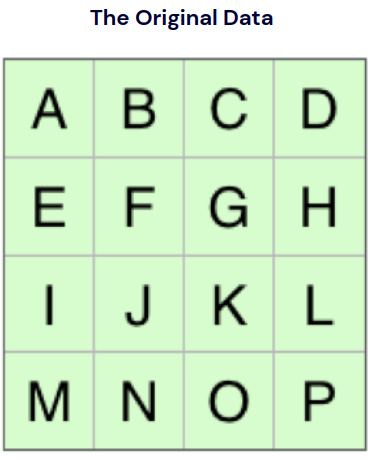
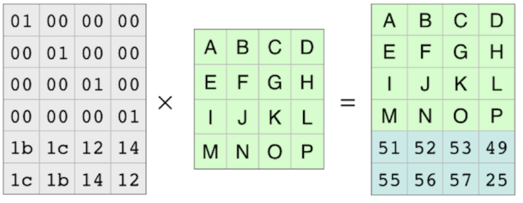
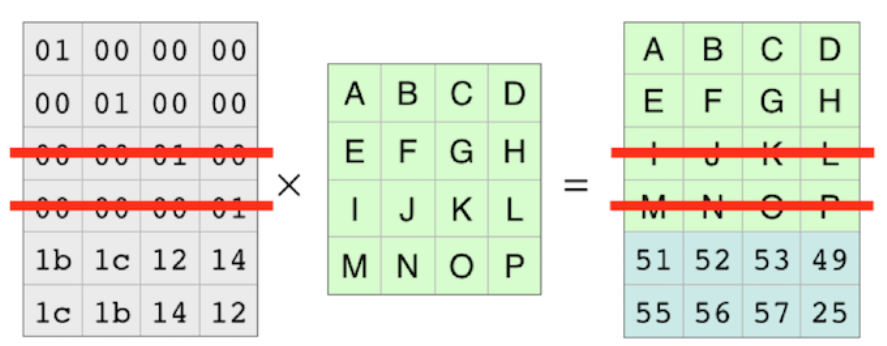
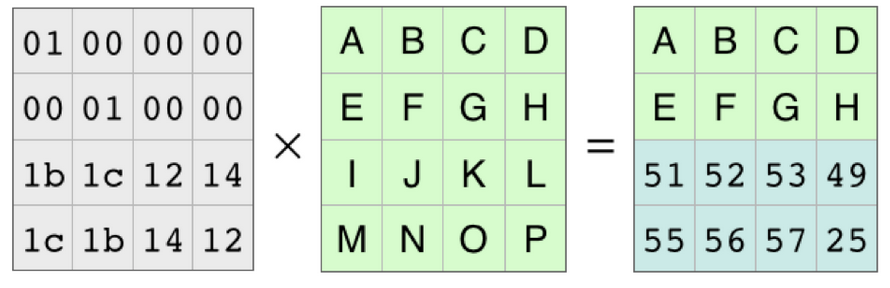
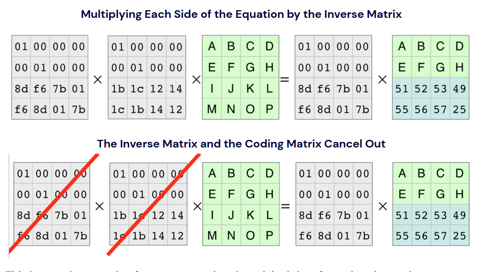
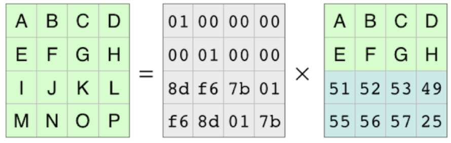

# 简介

参考文献 : https://www.backblaze.com/blog/reed-solomon/

Reed-Solomon是纠删码(Erasure Codes)的一种，被应用在Linux的RAID系统中。

Reed-Solomon能够实现在n个数据块和k个奇偶校验块中，从n+k块中任意选取n块，恢复成原先数据。

# 如何通过Reed-Solomon恢复数据

"4+2"(4个数据切片 + 2个奇偶校验)

## 原始数据

## 左乘矩阵

## 假设任意两行数据丢失

## 通过逆矩阵，将原先数据还原回来

## 恢复成功

